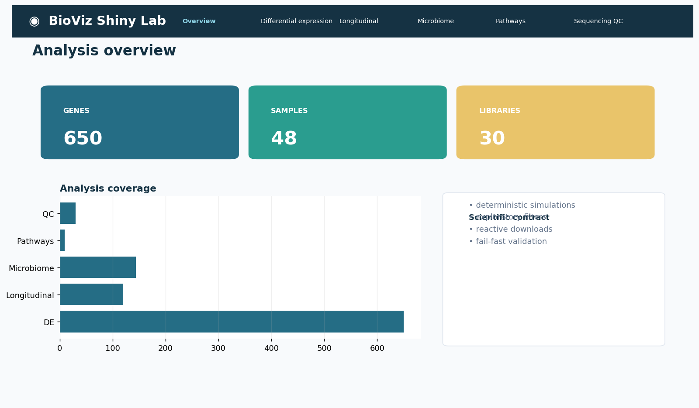
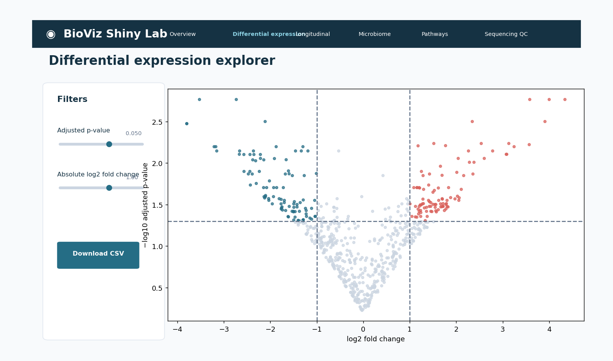
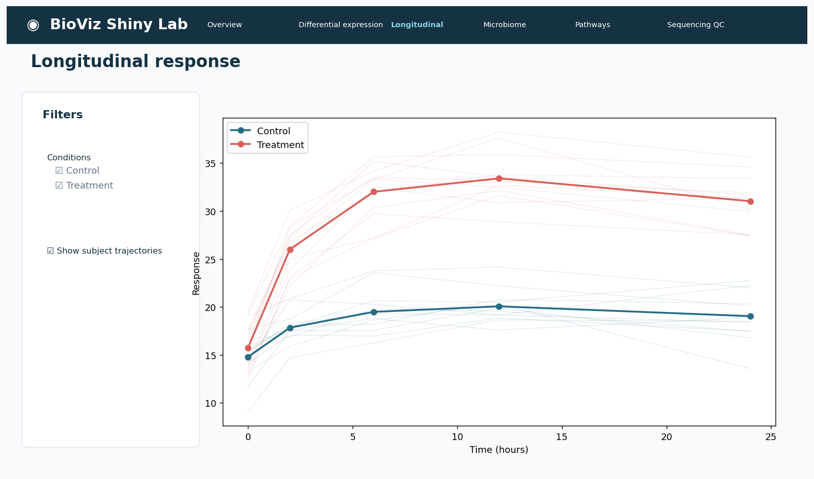
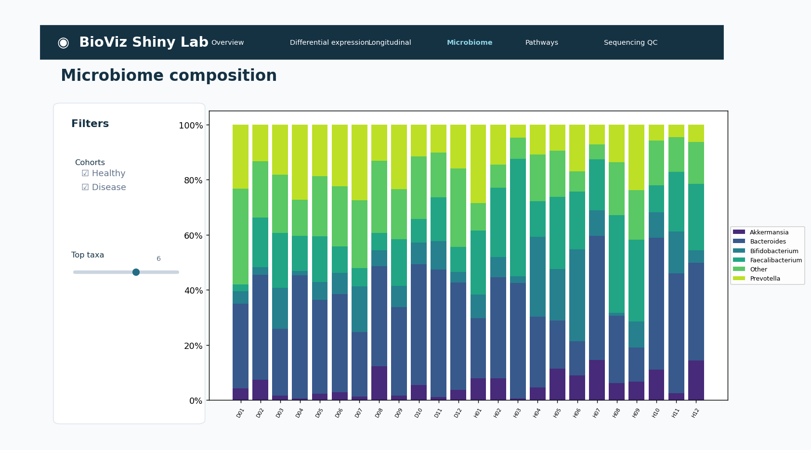
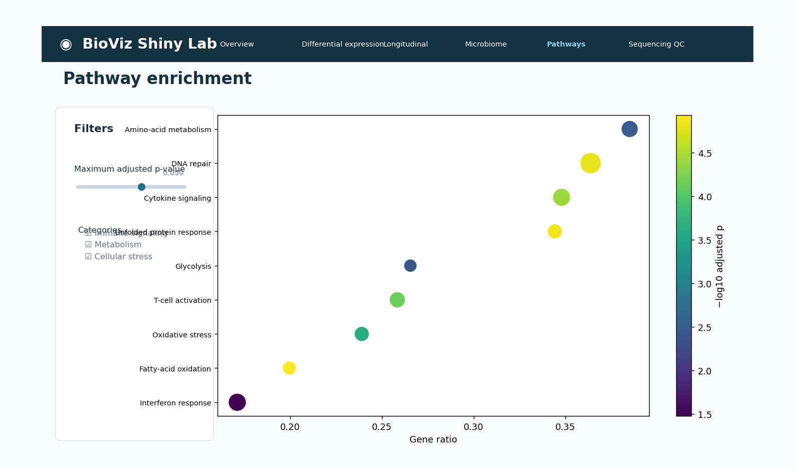
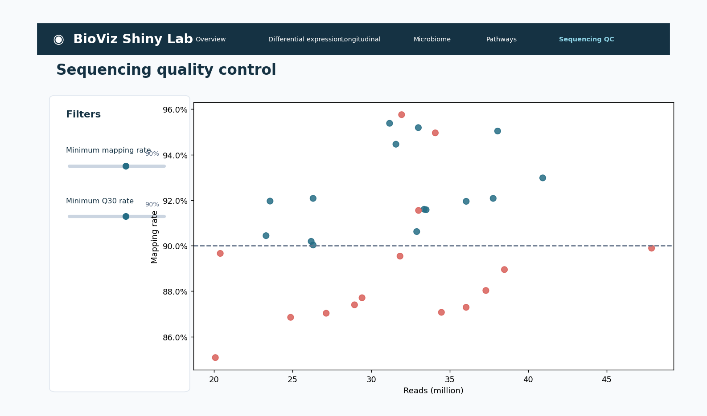
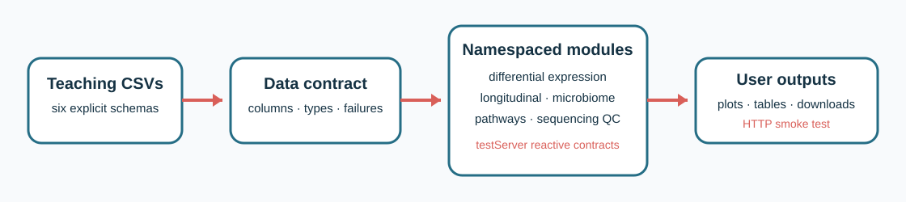

# BioViz Shiny Lab

[](https://github.com/mbilal-OU/Biology-data-viz-shiny/actions/workflows/ci.yml)
[](https://github.com/mbilal-OU/Biology-data-viz-shiny/actions/workflows/app-smoke.yml)
[](https://github.com/mbilal-OU/Biology-data-viz-shiny/actions/workflows/docs.yml)
[](https://shiny.posit.co/r/)
[](LICENSE.md)

A **production-minded, modular Shiny portfolio for biological data
exploration**. It demonstrates reactive contracts, namespaced modules,
interactive graphics, responsive Bootstrap 5 layout, downloads, validation,
server-side tests, startup smoke testing, container deployment, and explicit
scientific safeguards.

The bundled data are deterministic simulations. The application is an
exploration and teaching tool—not clinical software or a confirmatory analysis.

## Interface tour

| Application surface | Application surface |
|---|---|
| **Overview and data contracts**<br><br>At-a-glance scope, record counts, and interpretation boundaries. | **Differential expression**<br><br>Reactive FDR/effect thresholds, hover identifiers, table, and download. |
| **Longitudinal response**<br><br>Condition selection and optional subject trajectories preserve study design. | **Microbiome composition**<br><br>Reactive cohort and top-taxon controls with within-sample normalization. |
| **Pathway enrichment**<br><br>Category and adjusted-evidence filters update plot and table together. | **Sequencing quality control**<br><br>User-set QC thresholds flag libraries consistently across plot and table. |

## Architecture



Each module owns its input namespace, reactive transformation, output renderers,
and tests. Shared data loading validates schemas once; modules enforce
analysis-specific state without using global mutable variables.

## Run locally

```r
install.packages(c("remotes", "shiny"))
remotes::install_github("mbilal-OU/Biology-data-viz-shiny")
biovizshiny::run_app(launch.browser = TRUE)
```

For repository development:

```bash
git clone https://github.com/mbilal-OU/Biology-data-viz-shiny.git
cd Biology-data-viz-shiny
Rscript -e 'install.packages("pak"); pak::local_install_dev_deps()'
Rscript -e 'testthat::test_local()'
Rscript -e 'biovizshiny::run_app(host="0.0.0.0", port=3838)'
```

## What this repository proves

| Skill | Evidence |
|---|---|
| Reactive programming | Thresholds, cohorts, taxa, conditions, plots, tables, and downloads stay synchronized |
| Modular architecture | Six namespaced UI/server modules with explicit reactive inputs and returns |
| Interactive visualization | Plotly hover, linked reactive state, ggplot2 grammar, and responsive sizing |
| Biological analysis | Differential expression, repeated measures, composition, enrichment, and sequencing QC |
| Testability | `shiny::testServer()`, data-contract tests, R CMD check, coverage, and HTTP startup smoke test |
| Deployment | Local package, Docker image, Shiny Server layout, and platform deployment guidance |
| Scientific safety | Simulated-data labeling, transformation notes, protocol-specific QC, no clinical claims |

## Test and verify

```bash
Rscript -e 'testthat::test_local()'
R CMD build .
R CMD check --no-manual biovizshiny_1.0.0.tar.gz
docker build -t bioviz-shiny .
docker run --rm -p 3838:3838 bioviz-shiny
```

## Deployment choices

- **shinyapps.io** for a shareable hosted demonstration.
- **Posit Connect** for authentication, scaling, scheduled content, and organizational deployment.
- **Shiny Server / Docker** for self-managed infrastructure; the included container runs as an unprivileged application process behind Shiny Server.

Never put credentials in R source or the repository. Supply secrets through the
deployment platform, apply authentication upstream, limit uploads and memory,
and log errors without logging sensitive biological data.

## Scientific guardrails

- Reactive filtering is exploratory and does not rerun upstream statistical models.
- Subject trajectories preserve repeated-measure identity.
- Relative-abundance composition does not replace compositional inference.
- Pathway views assume a defined tested universe and adjusted p-values.
- QC thresholds are protocol-specific and support review rather than automatic acceptance.
- Downloaded subsets include current filters but not a claim of statistical significance beyond the supplied results.

## Portfolio series

- [Seaborn](https://github.com/mbilal-OU/biology-data-viz-seaborn) · [Matplotlib](https://github.com/mbilal-OU/biology-data-viz-matplotlib) · [Plotly](https://github.com/mbilal-OU/Biology-data-viz-plotly)
- [ggplot2](https://github.com/mbilal-OU/Biology-data-viz-ggplot2) · [ggtree + ComplexHeatmap](https://github.com/mbilal-OU/Biology-data-viz-ggtree-complexheatmap) · **Shiny**

Citation metadata are in [`CITATION.cff`](CITATION.cff). Code is under the [MIT License](LICENSE.md).

